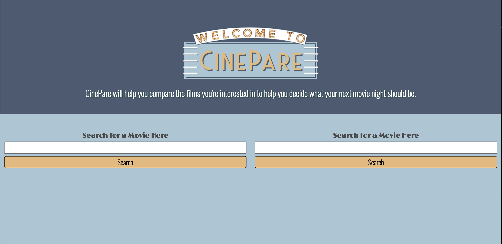
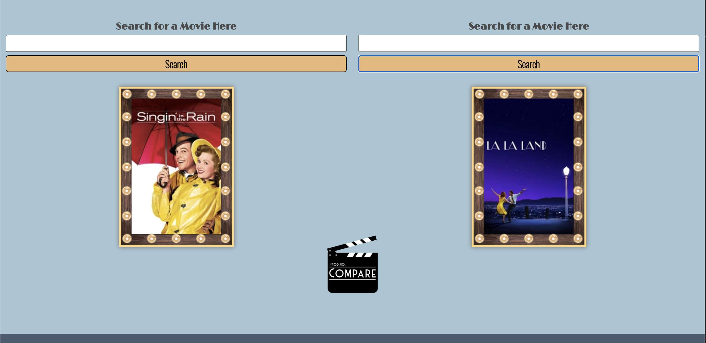
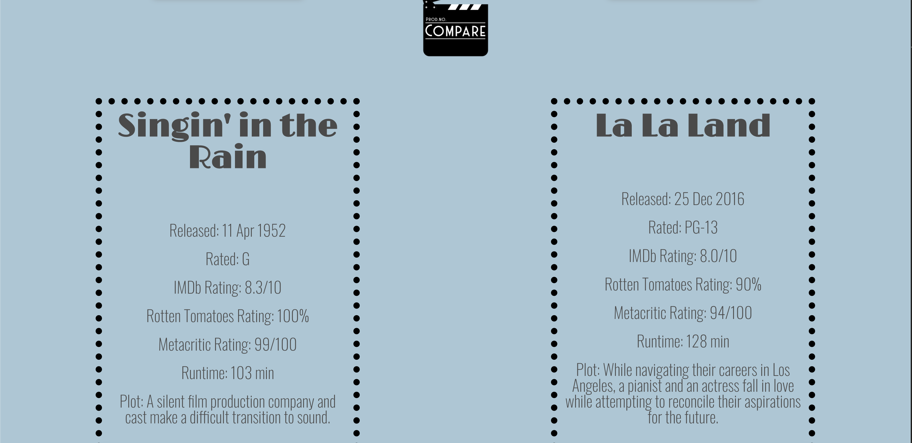

# cine_pare

https://adamalcantara.github.io/cinepare/

This was built using HTML, CSS, JavaScript, and Bulma, along with the OMDb API and the TMDb API.

Use CinePare to help you decide what movie you want to watch!  Enter two movies in the search boxes, and their poster will appear below.  If you like the movie based on the poster, click the compare button and a series of statistics about each movie will appear!

